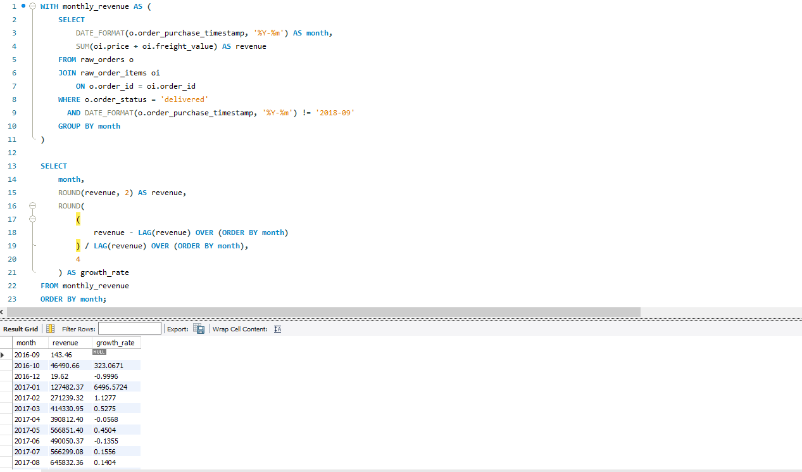
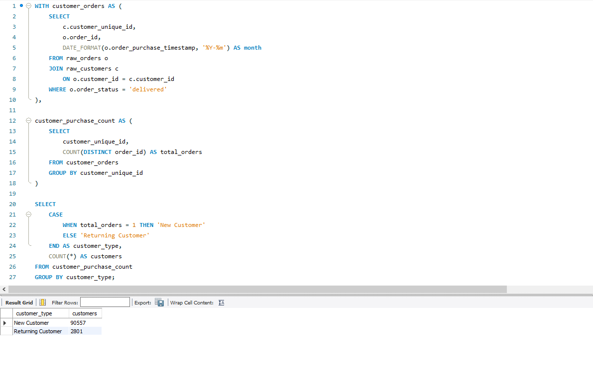
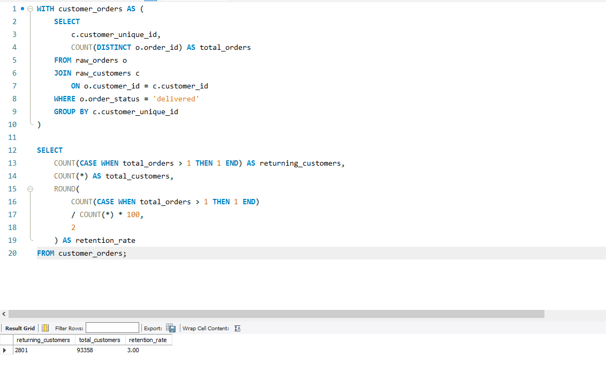
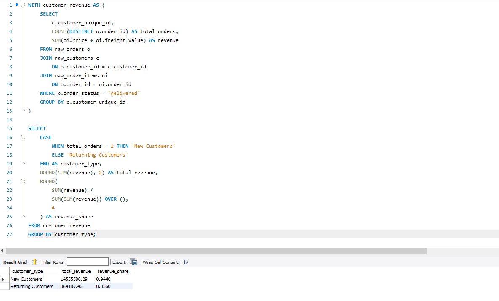
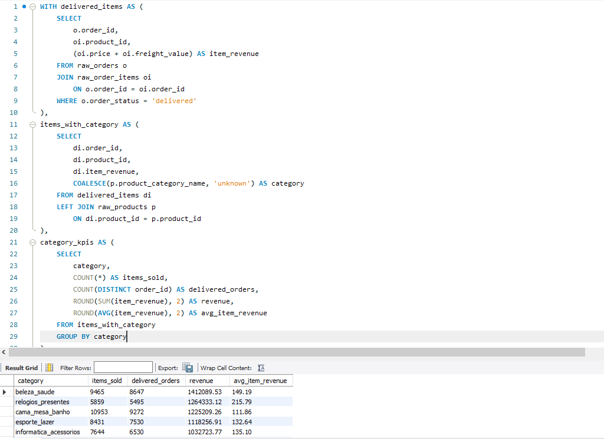

# E-commerce Business Analysis  
## Detecting Structural Weaknesses Hidden Behind Revenue Growth

End-to-end business analysis project focused on understanding how an e-commerce business can continue growing while developing critical customer retention weaknesses beneath the surface.

This project combines SQL and Power BI to analyze revenue evolution, customer behavior, retention performance, and long-term business sustainability.


# Executive Summary

At first glance, the business appeared to be performing strongly:

- Revenue grew consistently over time
- Order volume increased steadily
- Customer acquisition remained high
- Overall business KPIs looked healthy

However, deeper analysis revealed a significantly different reality beneath the surface.

Although revenue continued increasing, growth quality deteriorated over time due to extremely low customer retention and excessive dependence on new customer acquisition.

The business was not building a loyal customer base.

Instead, the company relied almost entirely on continuously attracting new users to sustain revenue growth.

The objective of this project was to determine whether the company’s growth was truly sustainable — or if positive revenue trends were hiding deeper structural weaknesses.

---

# Business Questions

This project was designed to answer several critical business questions:

- Was revenue growth still sustainable?
- Was business growth slowing down over time?
- Were customers returning after their first purchase?
- How dependent was the company on new customer acquisition?
- Did returning customers generate meaningful long-term value?
- Was the business building customer loyalty or only short-term growth?

---

# Tools Used

- SQL (MySQL)
- Power BI

---

# Project Workflow

## 1. Business Analysis (SQL)

SQL was used to perform the core business investigation and identify structural weaknesses behind the company’s apparent growth.

The analysis focused on several major business areas.

---

## Revenue Trend Analysis

Monthly revenue evolution was analyzed to understand the company’s overall growth trajectory.

The analysis measured:

- monthly revenue performance
- order volume evolution
- revenue stabilization patterns
- long-term growth behavior

The results showed strong initial growth followed by a clear slowdown and stabilization phase.

Although revenue continued increasing, growth momentum weakened progressively over time.

---

## Revenue Growth Analysis

Window functions were used to calculate month-over-month revenue growth rates.

The analysis measured:

- monthly growth acceleration
- growth slowdown periods
- negative growth events
- revenue momentum deterioration

The results confirmed that the business was gradually losing growth efficiency despite maintaining positive overall revenue.

This indicated that the company was transitioning from rapid expansion toward stagnation.




## Customer Segmentation Analysis

Customers were segmented between:

- new customers
- returning customers

This revealed one of the project’s most important findings:

The customer base was overwhelmingly dominated by first-time buyers.

Returning customers represented only a very small portion of total users.

This indicated that the business depended heavily on constant customer acquisition instead of customer loyalty.




## Customer Retention Analysis

Customer retention behavior was analyzed to evaluate long-term sustainability.

The analysis revealed that:

- retention remained extremely low across most periods
- only a small percentage of customers returned after their first purchase
- retention rates stayed around 2–3%

This suggested that the company struggled to convert buyers into repeat customers.

The business generated sales successfully, but failed to build long-term customer relationships.



## Revenue Dependency Analysis

Revenue contribution was analyzed between new and returning customers.

This revealed another major structural weakness:

More than 90% of total revenue came from new customers.

Although returning customers generated higher average revenue per user, their overall business impact remained minimal due to their extremely low volume.

This created significant scalability risk because future growth depended heavily on maintaining continuous customer acquisition.




## Product Category Analysis

Product categories were analyzed to evaluate overall revenue distribution and category-level business performance.

The analysis measured:

- total revenue by category
- delivered orders
- items sold
- average item revenue

This helped provide additional business context regarding the company’s revenue composition and commercial structure.




# Dashboard Development (Power BI)

A complete Power BI dashboard was developed to communicate the full business narrative visually.

The dashboard focused on:

- revenue growth evolution
- growth slowdown detection
- customer acquisition dependency
- retention deterioration
- new vs returning customer behavior
- revenue sustainability risks

The objective was not simply to visualize KPIs, but to explain why positive revenue growth alone can become misleading when customer retention remains weak.

---

# Key Findings

## Revenue growth remained positive

The company continued increasing revenue over time.

However, positive revenue growth alone failed to reflect underlying business deterioration.

---

## Growth momentum weakened progressively

Although revenue continued growing, growth rates slowed significantly over time.

This indicated declining business expansion efficiency.

---

## Customer retention remained extremely low

Retention rates stayed around 2–3% across most periods.

Most customers purchased only once and never returned.

---

## The business depended heavily on new customers

More than 90% of total revenue came from first-time buyers.

This revealed strong dependency on continuous customer acquisition.

---

## Returning customers generated higher value — but represented a very small group

Returning customers showed significantly higher average order value compared to new users.

However, their total business impact remained limited because very few customers actually returned.

---

# Final Business Conclusion

Although the company continued reporting positive revenue growth, the analysis revealed multiple structural weaknesses hidden beneath surface-level KPIs.

The business depended almost entirely on acquiring new customers while failing to build a loyal customer base.

At the same time:

- growth momentum weakened progressively
- retention remained critically low
- customer dependency risk increased
- long-term scalability became increasingly fragile

The analysis suggests that future growth may become difficult to sustain unless:

- customer retention improves
- customer lifetime value increases
- loyalty strategies strengthen
- dependency on acquisition decreases

This project demonstrates how positive e-commerce revenue growth can hide serious structural business weaknesses beneath surface-level performance metrics.

---

# Technical Skills Demonstrated

## SQL

- CTEs
- Window Functions
- LAG() analysis
- Aggregations
- Business KPI calculations
- Customer segmentation
- Retention analysis
- Revenue dependency analysis
- Multi-step analytical queries

---

## Power BI

- Dashboard development
- Business storytelling
- KPI visualization
- Interactive filtering
- Executive-style presentation
- Strategic insight communication

---

# Repository Structure

```plaintext
ecommerce-business-analysis/
│
├── README.md
│
├── sql/
│   ├── monthly_revenue_trend.sql
│   ├── revenue_growth_analysis.sql
│   ├── customer_retention_analysis.sql
│   ├── new_vs_repeat_customers.sql
│   ├── revenue_dependency_analysis.sql
│   └── product_category_kpis.sql
│
├── dashboard/
│   └── ecommerce_dashboard.pbix
│
├── presentation/
│   └── ecommerce_business_analysis.pdf
│
├── screenshots/
│   ├── dashboard_visuals/
│   └── sql_queries/
│
└── data/
```

---

# Author

Axel Gravagno

Data Analyst focused on business-driven analytics, customer behavior analysis, and long-term business sustainability.
